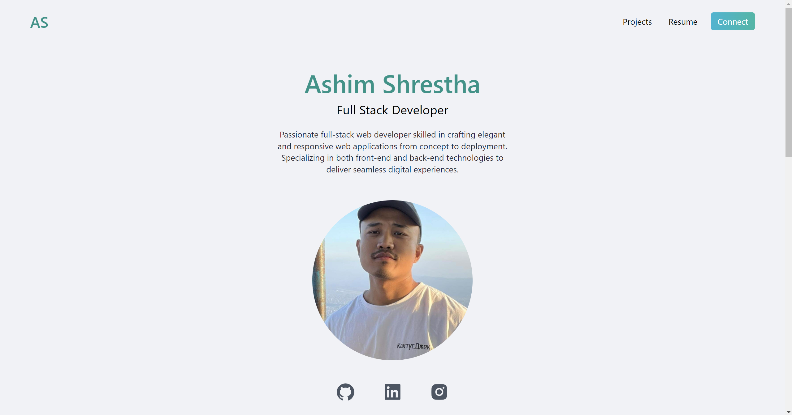
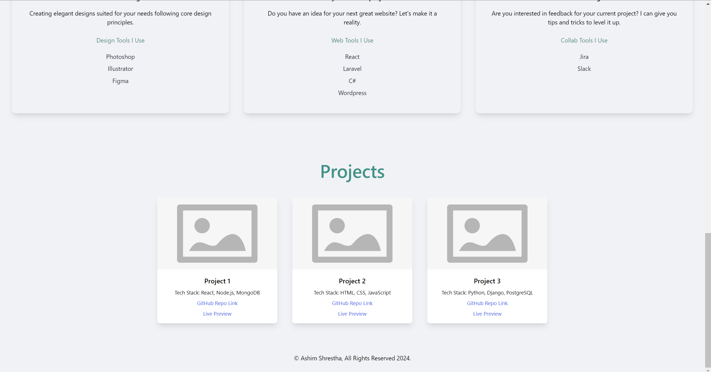

# React Portfolio Website with Backend API Integration

## Overview

This project aims to create a dynamic portfolio website using React.js, with data retrieved from a backend API. The website will serve as a showcase of projects, skills, and contact information.

## Requirements

1. **Frontend Technology**: The website must be built using React.js to ensure a modern and interactive user experience.

2. **Backend API Integration**: Data for the website will be retrieved from a backend API. This API can be implemented using technologies like PHP or Express.js. The API endpoints will return JSON data containing information about projects, skills, and contact details. There are a total of 3 apis in this project.

3. **Website Content**:

**Portfolio Section**:
- Display your name, desired role, and a brief introduction.
- Showcase projects with important details such as project name, screenshots URLs (if applicable), short blurbs about each project, and a listing of languages/technologies used.
- Provide a way to contact you, either through contact information or a contact form.

## Implementation Details

- **Frontend**: Utilize React.js for building the frontend components, including user details and project cards
- **Backend**: Implement the backend API using Express.js to serve JSON data to the frontend.
- **API Calls**: Use asynchronous API calls in React to fetch data from the backend and update the UI accordingly.
- **Styling**: Apply CSS or a CSS framework like Tailwind CSS to style the website and make it visually appealing.
- **Testing**: Conduct testing to ensure proper functionality and responsiveness across different devices and screen sizes.

## Deployment Steps

1. Develop the frontend and backend components separately.
2. Integrate the backend API endpoints into the frontend React application.
3. Test the website locally to ensure all features are working as expected.

## Conclusion

By following these steps, a professional portfolio website can be created that showcases your projects and skills, while also demonstrating your ability to integrate frontend and backend technologies effectively.

## Images

*Landing Page*

*Projects Section*
